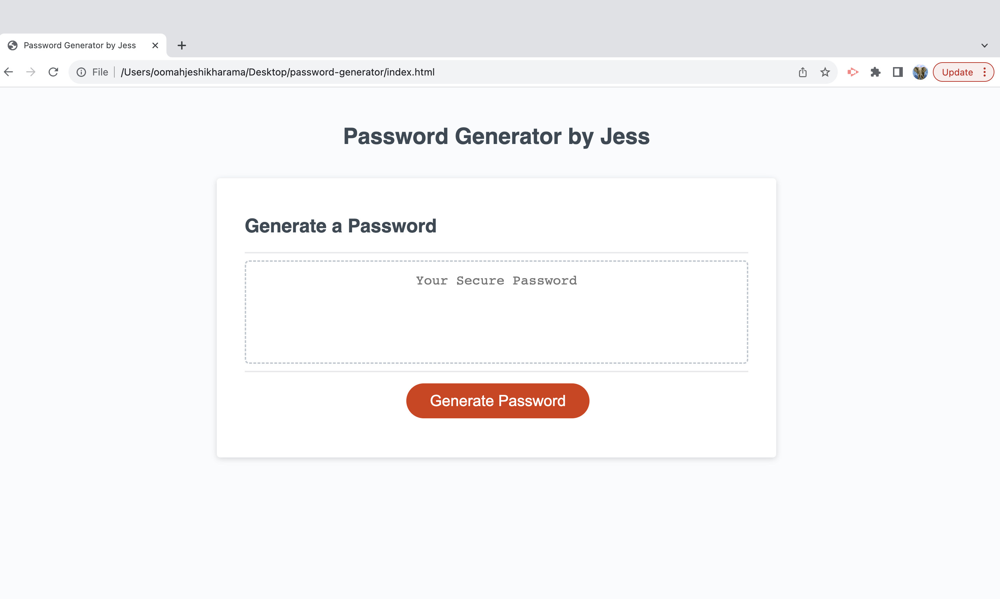
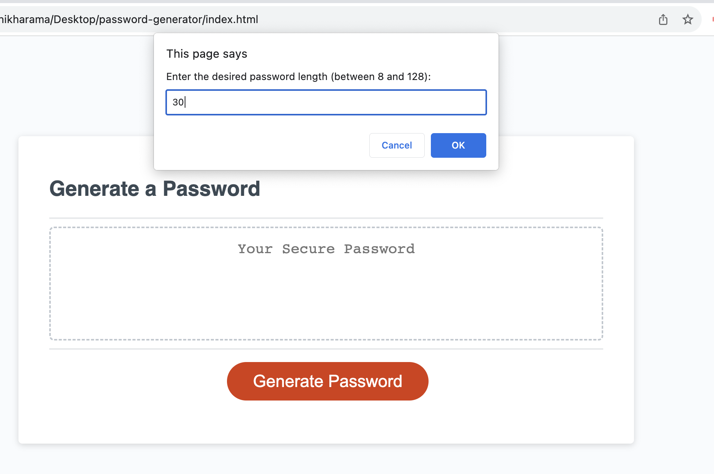
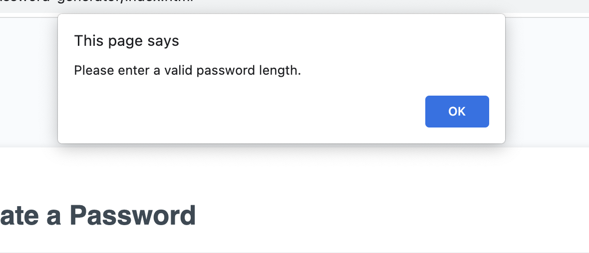
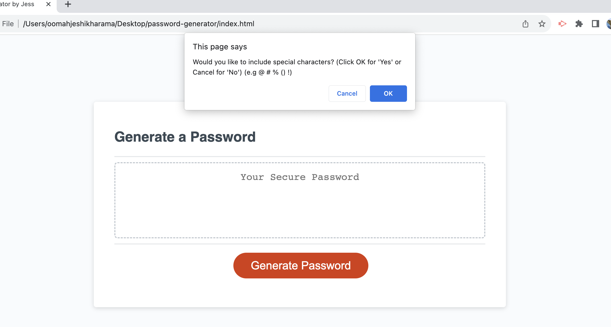
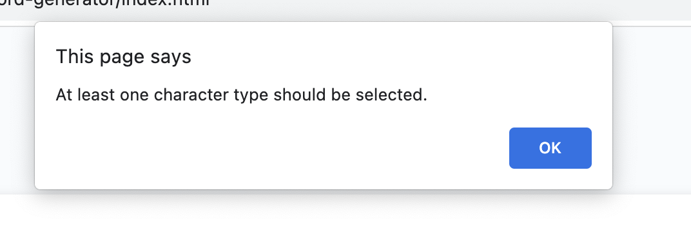
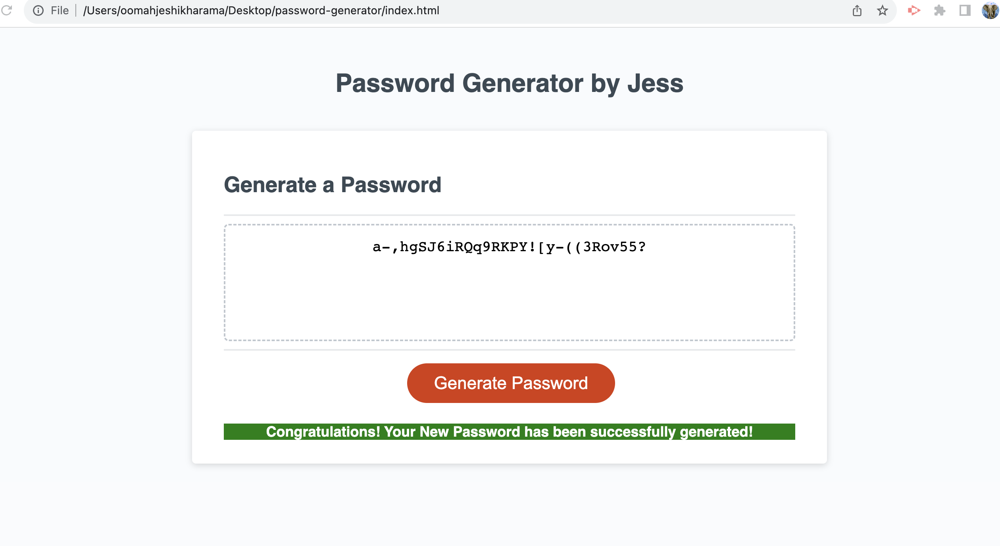

# Password Generator Challenge

## Overview

This repository contains my solution to the Password Generator Challenge as part of this week's challenge. The goal of this challenge was to create a web application for employees, that they can use to generate a random password based on criteria they’ve selected. The application features a starter code of HTML and CSS, and refactoring functionalities all powered by JavaScript code. The outcome of the challenge was a functional and user-friendly password generator web application. It adhered to the instructions by generating passwords within the specified length, ensuring that at least one character type was selected, and displaying the generated password appropriately.

## Instructions followed

The challenge required the application to which was successfully implemented as follows:

* Generating a password when the "Generate Password" button is clicked.
* Prompting the user for password criteria:
  - Length of password: At least 8 characters but no more than 128 - if not wrong input message is popped out.
  - Character types: Lowercase, Uppercase, Numeric, Special characters.
* Validating each input and ensure at least one character type is selected - if cancel chosen then no password generated due to no selection of any character types.
* Displaying the generated password either in an alert or on the page.

## Success Message Enhancement

To provide a better user experience, I implemented a success message that displays after a password is successfully generated. The message appears below the generated password input box. This feature enhances the feedback users receive when they generate a password.

## Challenges Faced

During this challenge, I faced difficulties in modifying the default `confirm()` prompt buttons to "Yes" and "No" instead of "Cancel" or "OK". After discussing the challenge with mentors and classmates, I realised that the `confirm()` function's behavior cannot be changed directly. I ended up updating the message instead to "Would you like to include special characters? (Click OK for 'Yes' or Cancel for 'No)".

## Tools Used

During the challenge, I used the following tools:

- Visual Studio Code: As my primary code editor for HTML, CSS, and editing JavaScript.
- Chrome DevTools/ Inspect/ Console: To test and debug my web application.
- GitHub: For version control and hosting my repository.

## Research and Lessons Learned
Throughout the week, I conducted research to better understand different functions of Javascript and the requirements of the Password Generator Challenge. I delved into topics such as JavaScript methods and user input validation. One key aspect of my research was understanding how to concatenate arrays, which was crucial for combining different character sets for password generation.

## Concatenation and Return
The concept of concatenation was pivotal in combining different arrays of character sets to create the pool of possible characters for generating passwords. By using the concat() method, I was able to merge arrays like special characters, numeric characters, lowercase characters, and uppercase characters into a single array, allowing me to randomly select characters from this pool during password generation.

Return statements were crucial for functions that needed to provide outputs. For instance, the getRandom() function used a return statement to provide a random character from an array. Similarly, the generatePassword() function returned the generated password after looping through the character sets and concatenating the selected characters.

## Acknowledgments

I would like to express my gratitude to my mentors and classmates who provided guidance and support throughout this challenge. Their insights and discussions played a significant role in overcoming challenges and improving my solution.

## License

This project is licensed under the MIT License

## Deployment - Useful Links to facilitate viewing of project
The URL of the deployed application:
* https://jeshikha.github.io/password-generator/    

The URL of the GitHub repository:
* https://github.com/Jeshikha/password-generator 

## Screenshots of Deployed App
The following image shows the web application's of the password generator:
* Webpage opening

* Choosing Length of Password

* Choosing Wrong Length Message

* Choosing character prompt message

* Not choosing any character types

* Successful message after generating password

